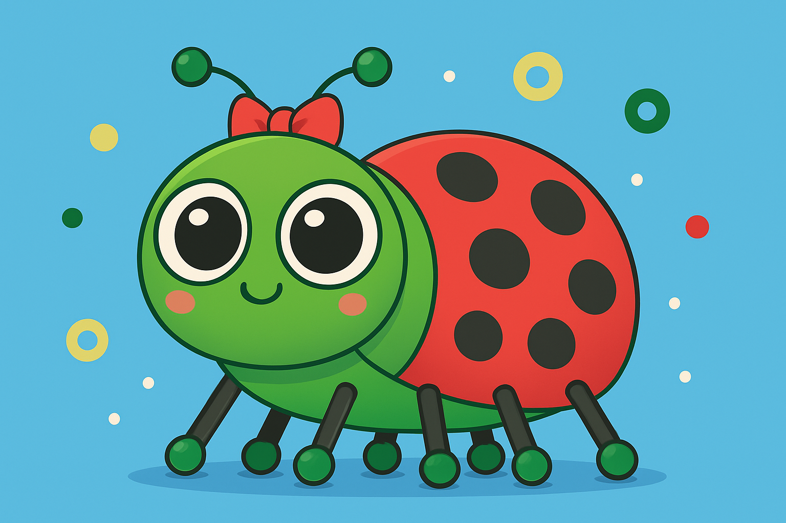

# Dot the Bug

Draw and decorate a cartoon insect using shapes and colours in Python with p5.

Find the project online at [projects.raspberrypi.org/en/projects/python-wild-dot-the-bug](https://projects.raspberrypi.org/en/projects/python-wild-dot-the-bug)

## Resources
For project materials and solutions, see [en/resources](https://github.com/raspberrypilearning/python-wild-dot-the-bug/tree/master/en/resources) and [en/solutions](https://github.com/raspberrypilearning/python-wild-dot-the-bug/tree/master/en/solutions).

## Contributing
See [CONTRIBUTING.md](CONTRIBUTING.md)

## Licence
See [LICENCE.md](LICENCE.md)
