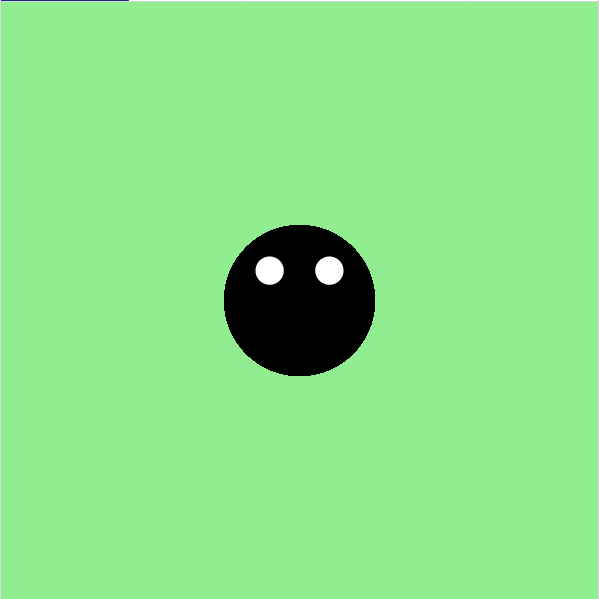

<h2 class="c-project-heading--task">Add Dot's eyes</h2>

--- task ---

Draw two smaller circles to give Dot some eyes.

--- /task ---

<h2 class="c-project-heading--explainer">Can Dot see?</h2>

Let’s give Dot the Bug two cartoon eyes!

You can use `fill('white')` to change the colour, and `circle(x, y, size)` to draw each one.

Remember: the eyes are just smaller circles. You can place them anywhere on Dot’s body.

Try changing the position or size to make Dot look sleepy, surprised, or silly!

--- code ---
---
language: python
filename: main.py
line_numbers: true
line_number_start: 9
line_highlights: 12-14
---

    fill('black')
    circle(200, 200, 100)

    fill('white')
    circle(180, 180, 20)
    circle(220, 180, 20)

run()

--- /code ---

### Tip

Try moving the eyes closer together or further apart.  
You can even make one eye bigger than the other!  
Change the numbers to create your own unique look.

### Debugging

If the eyes don’t appear: 
- Make sure `fill('white')` comes **before** the eye circles 
- Check that each `circle()` has 3 numbers: x, y, and size 

