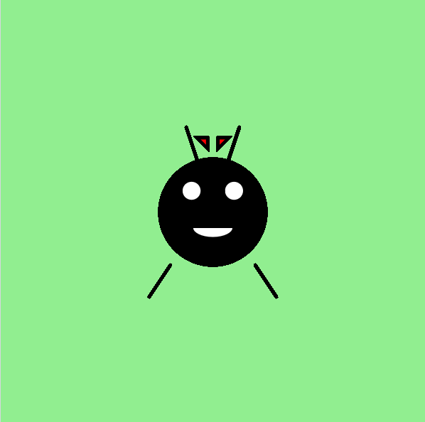

<h2 class="c-project-heading--task">Decorate Dot!</h2>
--- task ---
Use any shapes you like to give Dot a personal touch.
--- /task ---

<h2 class="c-project-heading--explainer">Make Dot your own</h2>

Dot is ready to meet the world — but every bug deserves their own unique look!

Let’s decorate Dot with some extras. You could add:

- A bow, crown, or hat with `triangle()` or `rect()`
- Cheeks or spots with smaller `circle()`s
- Eyelashes or eyebrows using `line()`
- A bug friend next to Dot!

Here’s an example that adds a red bow on Dot’s head:

--- code ---
---
language: python
filename: main.py
line_numbers: true
line_number_start: 24
line_highlights: 27-29
---
    fill('white')
    arc(200, 215, 40, 20, radians(0), radians(180))

    fill('red')
    triangle(195, 140, 185, 130, 195, 130)
    triangle(205, 140, 215, 130, 205, 130)

run()
--- /code ---

### Tip

- Want to change Dot’s personality? Try adding eyebrows!
- Give Dot a best friend using another set of shapes nearby.
- Use colours like `'pink'`, `'orange'`, `'skyblue'`, or RGB values like `fill(255, 255, 0)`.

### Debugging

If your decorations don’t show up: 
- Make sure they come **after** Dot’s body in the `draw()` 
- `run()` should be the very last line of your code 
- Check that the x and y values are between 0 and 400 for all shapes

