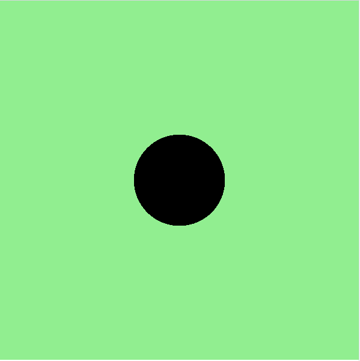

<h2 class="c-project-heading--task">Teken het lichaam van Dot</h2>

\--- task ---

Teken een cirkel om het lichaam van Dot de kever te maken.

\--- /task ---

<h2 class="c-project-heading--explainer">Je eerste vorm!</h2>

Dit is Dot the kever's eerste verschijning op het scherm!

In dit project ga je een cartoonachtig insect maken met Python en code uit de p5-bibliotheek. Je begint met het tekenen van één grote cirkel: het lichaam van Dot!

Hier is de startcode om je op weg te helpen. Het bevat de functies `setup()` en `draw()` die p5 gebruikt om je schets op te bouwen.

De functie `draw()` wordt elke frame uitgevoerd. Momenteel tekent het slechts één vorm, maar je kunt er binnenkort meer toevoegen!

--- code ---
---
language: python
filename: main.py
line_numbers: true
line_number_start: 1
line_highlights: 9-10
---

from p5 import \*

def setup():
size(400, 400)
background('lightgreen')

def draw():
\# Teken Dot hier!
fill('black')
circle(200, 200, 100)

run()

\--- /code ---

### Tip

Je kunt experimenteren met de waarden van `circle()`:

- Het **eerste getal** is de x-positie van het **middelpunt** van de cirkel
- Het **tweede getal** is de y-positie van het **middelpunt** van de cirkel
- Het **derde getal** is de grootte

Probeer de getallen te veranderen en verschillende kleuren te gebruiken in `fill()`, zoals `purple` (paars) of `orange` (oranje)!

### Foutopsporing

Als je de cirkel niet ziet: 

- Controleer of `circle()` zich binnen de `draw()`-functie bevindt 
- Zorg ervoor dat `fill()` vóór `circle()` komt 
- Vergeet niet om `run()` helemaal aan het einde van je bestand toe te voegen!

