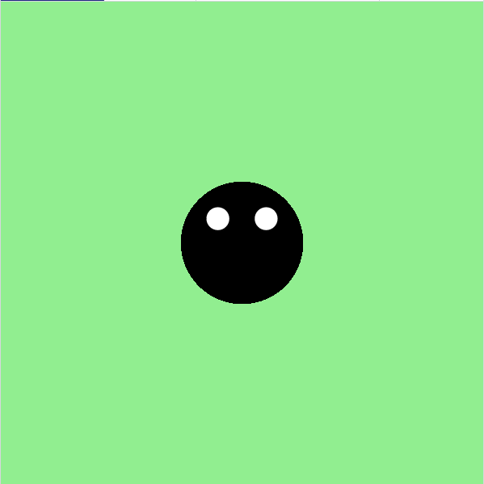

<h2 class="c-project-heading--task">Voeg Dots ogen toe</h2>

--- task ---

Teken twee kleinere cirkels om Dot ogen te geven.

--- /task ---

<h2 class="c-project-heading--explainer">Kan Dot zien?</h2>

Laten we Dot de kever twee cartoonogen geven!

Je kunt `fill('white')` gebruiken om de kleur te veranderen en `circle(x, y, grootte)` om ze te tekenen.

Onthoud: de ogen zijn gewoon kleinere cirkels. Je kunt ze overal op Dots lichaam plaatsen.

Probeer de positie of grootte te veranderen om Dot er slaperig, verrast of grappig uit te laten zien!

--- code ---
---
language: python
filename: main.py
line_numbers: true
line_number_start: 9
line_highlights: 12-14
---

    fill('black')
    circle(200, 200, 100)
    
    fill('white')
    circle(180, 180, 20)
    circle(220, 180, 20)

run()

--- /code ---

### Tip

Probeer de ogen dichter bij elkaar of verder uit elkaar te bewegen.  
Je kunt zelfs het ene oog groter maken dan het andere!  
Verander de getallen om je eigen unieke uiterlijk te maken.

### Foutopsporing

Als de ogen niet verschijnen: 

- Zorg ervoor dat `fill('white')` **vóór** de oogcirkels komt 
- Controleer of elke `circle()` 3 getallen heeft: x, y en grootte 

