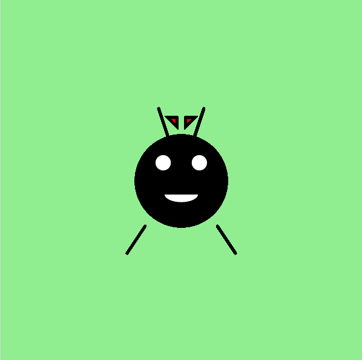

<h2 class="c-project-heading--task">Versier Dot!</h2>

--- task ---

Gebruik alle vormen die je leuk vindt om Dot een persoonlijk tintje te geven.

--- /task ---

<h2 class="c-project-heading--explainer">Maak jouw eigen Dot</h2>

Dot is klaar om de wereld te ontmoeten, maar elk insect verdient een unieke uitstraling!

Laten we Dot wat extra versieringen geven. Je zou het volgende kunnen toevoegen:

- Een strik, kroon of hoed met `triangle()` of `rect()`
- Wangen of sproeten met kleinere `circle()`s
- Wimpers of wenkbrauwen tekenen met `line()`
- Een insectenvriendje naast Dot!

Hier is een voorbeeld waarbij een rode strik op Dots kop wordt toegevoegd:

<div class="c-project-code">
--- code ---
---
language: python
filename: main.py
line_numbers: true
line_number_start: 24
line_highlights: 27-29
---

    ```
    fill('white')
    arc(200, 215, 40, 20, radians(0), radians(180))
    
    fill('red')
    triangle(195, 140, 185, 130, 195, 130)
    triangle(205, 140, 215, 130, 205, 130)
    ```

run()

--- /code ---

</div>

<div class="c-project-output">

</div>

<div class="c-project-callout c-project-callout--tip">

### Tip

- Wil je Dots persoonlijkheid veranderen? Probeer eens wenkbrauwen toe te voegen!
- Geef Dot een beste vriend door een andere set vormen in de buurt te gebruiken.
- Gebruik kleuren zoals 'pink' (roze), 'orange' (oranje), 'skyblue' (lichtblauw) of RGB-waarden zoals 'fill(255, 255, 0)'.

</div>

<div class="c-project-callout c-project-callout--debug">

### Foutopsporing

Als je versieringen niet worden weergegeven:<br />

- Zorg ervoor dat ze **na** Dot's lichaam komen in de `draw()`<br />
- `run()` moet de allerlaatste regel van je code zijn<br />
- Controleer of de x- en y-waarden voor alle vormen tussen 0 en 400 liggen

</div>

<div class="c-project-callout c-project-callout--tip">

### Terugkoppeling

Dit is een bètaproject, wat betekent dat het gloednieuw is en nog niet algemeen beschikbaar. Als je dit project zelf of met je club hebt getest, laat ons dan weten wat je ervan vindt.

<a href="https://form.raspberrypi.org/4874054?tfa_6933=python-wild-dot-the-bug" style="
display: inline-block;
padding: 10px 20px;
border: 2px solid black;
border-radius: 999px;
font-weight: bold;
font-size: 16px;
background-color: white;
color: black;
text-align: center;
text-decoration: none;
transition: background-color 0.2s;
" onmouseover="this.style.backgroundColor='#f0f0f0';" onmouseout="this.style.backgroundColor='white';">
Geef feedback </a>

</div>

***
Dit project werd vertaald door vrijwilligers:

[name]

[name]

[name]

Dankzij vrijwilligers kunnen we mensen over de hele wereld de kans geven om in hun eigen taal te leren. Jij kunt ons helpen meer mensen te bereiken door vrijwillig te starten met vertalen - meer informatie op [rpf.io/translate](https://rpf.io/translate).
