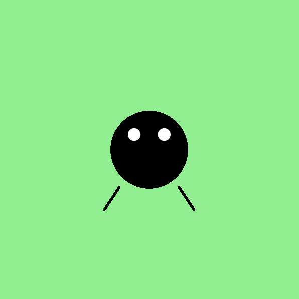

<h2 class="c-project-heading--task">Додайте Горошинці лапки</h2>

\--- task ---

Використайте функцію `line()`, щоб намалювати лапки для Горошинки.

\--- /task ---

<h2 class="c-project-heading--explainer">Додаймо Горошинці лапки!</h2>

Тепер, коли у Горошинки є тіло та очі, час дати їй лапки.

Ви можете скористатися функцією `line()`, щоб намалювати лапки, з'єднавши дві точки.  
За допомогою: `line(x1, y1, x2, y2)`

Щоб лапки було легше побачити, використовуйте `stroke('black')` для встановлення кольору та `stroke_weight(3)` для збільшення товщини ліній.

Додайте це до вашої функції `draw()`:

<div class="c-project-code">
--- code ---
---
language: python
filename: main.py
line_numbers: true
line_number_start: 12
line_highlights: 16-19
---

    ```
    fill('white')
    circle(180, 180, 20)
    circle(220, 180, 20)
    
    stroke('black')
    stroke_weight(3)
    line(160, 250, 140, 280)
    line(240, 250, 260, 280)
    ```

run()

\--- /code ---

</div>

<div class="c-project-output">

</div>

<div class="c-project-callout c-project-callout--tip">

### Поради

- Спробуйте намалювати лапки зверху або збоку тіла<br />
- Використовуйте різні значення `stroke_weight()`, щоб зробити лапки товстішими або тоншими<br />
- Використовуйте `fill()` перед колами, та `stroke()` перед лініями!

</div>

<div class="c-project-callout c-project-callout--debug">

### Налагодження

Якщо нічого не відбувається: <br />

- Переконайтеся, що виклики `line()` знаходяться всередині функції `draw()`<br />
- Ви використали всі чотири числа для кожної лапки?<br />
- Переконайтеся щоб `stroke()` та `stroke_weight()` були перед вашими рядками

</div>
