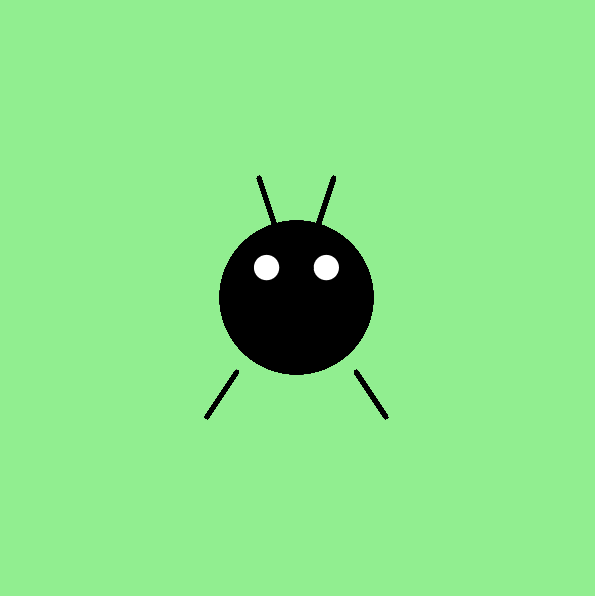

<h2 class="c-project-heading--task">Додайте Горошинці антен</h2>

\--- task ---

Використайте функцію `line()`, щоб намалювати дві антени для Горошинки.

\--- /task ---

<h2 class="c-project-heading--explainer">Додамо нові ознаки жука</h2>

Багато жуків мають гнучкі вусики, що допомагають їм орієнтуватися у світі. Додаймо два Горошинці!

Знову використаємо функцію `line()`, щоб намалювати кожну з них. Почніть лінії від верхівки голови Горошинки та спрямуйте їх вгору або в боки.

Ось що Ви маєте зробити:

<div class="c-project-code">
--- code ---
---
language: python
filename: main.py
line_numbers: true
line_number_start: 18
line_highlights: 21-22
---

    ```
    line(160, 250, 140, 280)
    line(240, 250, 260, 280)
    
    line(185, 150, 175, 120)
    line(215, 150, 225, 120)
    ```

run()

\--- /code ---

</div>

<div class="c-project-output">

</div>

<div class="c-project-callout c-project-callout--tip">

### Поради

- Спробуйте зробити одну антену довшою за іншу, щоб отримати смішний вигляд<br />
- Спробуйте нахилити їх у різних напрямках для неповторності своєї Горошинки

</div>

<div class="c-project-callout c-project-callout--debug">

### Налагодження

Якщо антени не з'являються:<br />

- Ще раз перевірте, чи початок лінії знаходиться біля голови Горошинки<br />
- Переконайтеся, що ви використовуєте `stroke()` та `stroke_weight()`

</div>
