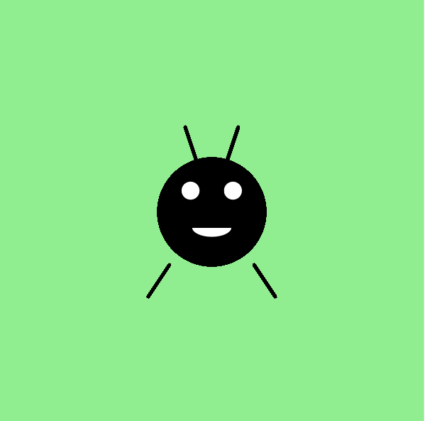

<h2 class="c-project-heading--task">Додайте рот за допомогою дуги</h2>

\--- task ---

Використайте функцію `arc()`, щоб Горошинка посміхнулась.

\--- /task ---

<h2 class="c-project-heading--explainer">Сииииииир!</h2>

Горошинка майже готова, залишилась лише посмішка!

Ти можеш використати функцію `arc()`, щоб намалювати криву, яка виглядає як посмішка.  
Переконайтеся, що ви використовуєте `fill('white')`, щоб посмішка виділялася на тлі Горошинки.

У p5 функція `arc()` виглядає так:  
`arc(x, y, width, height, start_angle, stop_angle)`

Start_angle та stop_angle визначають величину кола.  
Наша посмішка почнеться ліворуч (0°) і закінчиться праворуч (180°) — це створить півколо!

Оскільки p5 працює в **радіанах**, а не в градусах, вам потрібно буде використовувати `radians()` для перетворення значень.

Ось що потрібно додати під очима:

<div class="c-project-code">
--- code ---
---
language: python
filename: main.py
line_numbers: true
line_number_start: 21
line_highlights: 24-25
---

    ```
    line(185, 150, 175, 120)
    line(215, 150, 225, 120)
    
    fill('white')
    arc(200, 215, 40, 20, radians(0), radians(180))
    ```

run()

\--- /code ---

</div>

<div class="c-project-output">

</div>

<div class="c-project-callout c-project-callout--tip">

### Поради

- Перемістіть дугу вгору або вниз, щоб посмішка Горошинки була вище або нижче<br />
- Змініть розмір, щоб зробити посмішку Горошинки ширшою, вищою або безглуздішою

</div>

<div class="c-project-callout c-project-callout--debug">

### Налагодження

Якщо посмішка не з'являється:<br />

- Ви використали `fill('white')`, щоб зробити рот видимим?<br />
- Чи знаходяться координати x/y дуги під очима?<br />
- Обов'язково використовуйте `radians()` з числами типу `radians(180)`

</div>